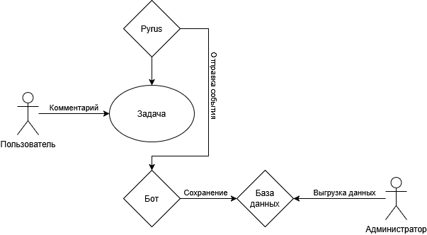

# Журнал активности Pyrus РАНХиГС

Бот для сбора активности работников РАНХиГС в системе Pyrus.

## Описание

Бот находится в списке наблюдателей каждой задачи в Pyrus. В момент, когда пользователь
пишет комментарий или обновляет информацию в задачу, платформа Pyrus отправляет информацию
о произошедшем событии посредством вебхука — таким образом облачная система Pyrus связывается
с локальной сетью и оборудыванием РАНХиГС.

## Сценарий использования

Пользователь заходит в задачу Pyrus, пишет комментарий или обновляет какую-либо информацию
в задаче, затем сохраняет внесенные изменения.

Администратор при необходимости осуществляет выгрузку активности пользователей
из базы данных для дальнейшего использования в аналитических целях руководства РАНХиГС.
